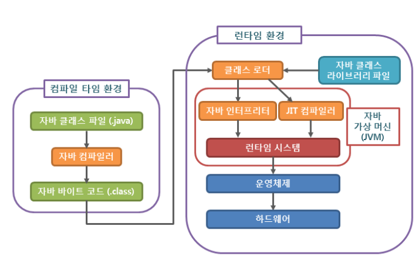
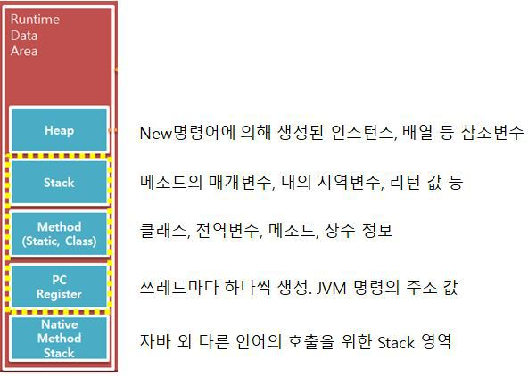
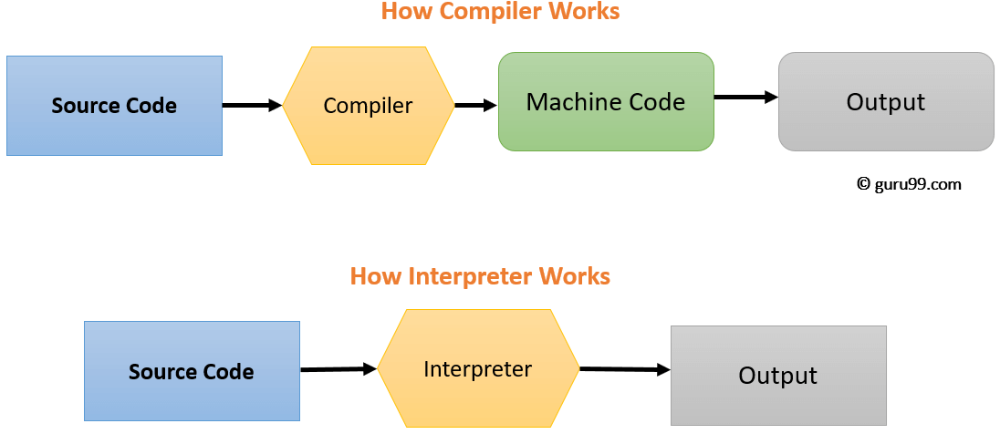

자바는 OS에 독립적인 특징을 가지고 있다. 그것은 JVM(Java Virtual Machine) 덕분이다.

JVM(Java Virtual Machine)은 OS와 프로그램 사이에서 기계어로 해석해 주는 역할을 하기 때문이다.

어떠한 OS든 Java가 설치 되어 있다면 JVM에 의해서 자바소스코드(.java)가 기계어로 해석될 수 있다.

### 자바 컴파일 순서

1. 개발자가 자바소스코드를 작성(.java)

 

2. Build 시,  자바컴파일러(java compiler)가 javac 명령어를 사용해, 자바소스파일(.java)을 컴파일하여 자바바이트코드(.class)(반기계어) 파일을 생성한다.

    * 아직 컴퓨터가 읽을 수 없는 JVM(자바가상머신)이 이해할수 있는 중간단계의 코드이다.  
  자바바이트 코드(.class)의 각 명령어는 1바이트 크기의 Opcode와 추가 피연산자로 이루어져있다.

 

3. 각 컴파일된 바이트 코드(.class)를 클래스로더(Class Loader)에 전달한다.

 

4. 클래스로더(Class Loader)는 동적로딩(Dynamic Loading)을 통해 필요한 클래스들을 로딩, 링크 하여 런타임 데이터영역(runtime data area), 즉 JVM의 메모리에 올린다.

    * 런타임 시, 바이트코드를 기계어로 바꿔주는데 이 역할을 JVM에서 한다.

    * 클래스 로더의 세부동작

      1. 로드 : 클래스 파일을 가져와서 JVM의 메모리에 로드한다.

      2. 검증 : 자바 언어 명세 (java language specification)및 JVM 명세 명시된 대로 구성되어 있는지 검사

      3. 준비 : 클래스가 필요로하는 메모리를 할당한다 (필드, 메소드, 인터페이스 등.)

      4. 분석 : 클래스의 상수 풀 내 모든 심볼릭 레퍼런스를 다이렉트 레퍼런스로 변경한다.

      5. 초기화 : 클래스 변수들을 적절한 값으로 초기화 한다.( static 필드)

 

5. Runtime Data Area를 거쳐 실행엔진(Execution Engine)으로 간다.
실행엔진(Execution Engine)은 JVM 메모리에 올라온 바이트 코드들을 명령어 단위로 하나씩 가져와서 실행한다

    * 이때, 실행 엔진에서 바이트코드로 변환하는 두 가지 방식이 있다.

      1. 인터프리터(Interpreter):
          - 바이트 코드 명령어를 하나씩 읽어서 해석하고 실행한다.
          - 하나하나의 실행은 빠르나, 전체적인 실행 속도가 느리다는 단점을 가진다

      2. JIT 컴파일러(Just-In-Time Compiler) :

          - 인터프리터의 단점을 보완하기 위해 도입된 방식이다.
        인터프리터 방식을 이용하다가 적정한 때에 바이트코드 전체를 기계어로 바꾸는 방식을 취한다.
        이때 기계어는 캐싱을 이용하기 때문에 인터프리터의 단점을 극복할 수 있다.
          - 바이트 코드(.class) 전체를 컴파일하여 Binary Code(기계어)로 변경하고, 이후에는 해당 메서드를 더이상 인터프리팅 하지 않고, Binary Code(기계어)로 직접 실행한다.
          - 하나씩 인터프리팅하여 실행하는 것이 아니라 바이트 코드 전체가 컴파일된 바이너리 코드를 실행하는 것이기 때문에 전체적인 실행속도는 인터프리팅 방식보다 빠르다.
          (캐시 사용으로 한번 컴파일 하면 빠르게 수행된다)

---

### 간단 정리)

- 자바소스코드(.java)를 작성하고 빌드하면, 컴파일러가 소스코드(.java)를 자바 바이트코드(.class)로 변환 JVM(자바가상기계) 바이트 코드를 기계어(Binary Code)로 변환하고, 인터프리터 방식으로 애플리케이션을 실행한다.

---

## 좀더 알아보기!

## Runtime Data Area, 메모리 영역

### **Stack Area**

- 클래스 내의 메소드에서 사용되는 정보들이 저장되는 공간이다.
- 매개변수, 지역변수, 리턴값 등이 저장되며 LIFO(Last In First Out) 방식으로 메소드 실행 시 저장되었다가 실행이 완료되면 제거 된다.
- 임시 저장공간으로 생각하면된다.

### **Method(Class, Static) Area**

- 클래스와 메소드, 전역변수(클래스, 인스턴스)와 상수(final) 정보 등이 저장되는 공간이다.

### **Heap Area**

- New명령어를 통해 생성한 인스턴스와 배열 등의 참조형 변수정보가 저장되는 공간이다.
- 물론 Method Area에 올라온 클래스들만 생성이 가능하다.
- GC(가비지콜렉션, Garbage Collection)의 대상이 된다.

### PC Register Area

- 쓰레드마다 하나씩 생성한다.
- JVM 명령의 주소값이 저장되는 공간이다.

### Native Method Stack Area

- 자바 외 다른 언어의 호출을 위해 할당되는 영역이다.
- 자바에서 C/C++의 메소드를 호출할 때 사용하는 Stack 영역이라고 생각하면 된다.

**예시를 통해 살펴보기)**

예를 들어 getList, insertList, updateList, deleteList CRUD 메소드가 있는 ListController class가 있을 때,
이 클래스와 메소드의 정보는 실행엔진에 의해 Method 영역에 올라가며, 클래스의 메소드 호출이 발생하면 Method 영역의 정보를 읽어 해당 메소드의 매개변수, 지역변수 리턴값 등이 Stack 영역에 올려 처리되게 된다.
그리고 메소드의 실행이 끝나면 Stack 영역에서는 자동으로 제거된다.

만약, 메소드 내에 New 명령어로 생성한 인스턴스나 배열이 있을 경우 해당 값은 Heap 영역에 저장되고 Stack 영역에서는 이 Heap 영역의 값을 참조 할 수 있는 메모리 주소 값만 저장되게 된다.

이것은 배열을 System.out.println(); 하게 되면 메모리 주소 값이 출력되는 이유이다.

---

## 인터프리터와  JIT 컴파일러

인터프리터는 사용자가 작성한 소스코드를 '한 문장씩 읽고' 바로 기계어로 바꿔준다.
그 후에 변환된 코드를 실행한다.

그러나, 컴파일러는 '전체 소스코드' 를 모두 기계어 파일로 바꿔주고 그 후에 변환된 코드를 실행한다.

빌드 시, 인터프리터는 큰 일을 하지 않지만 컴파일러는 기계어 소스 코드를 기계어 파일로 생성하기 때문에 오래 걸리는 것 처럼 보일 수 있다.

그러나, 인터프리터는 한 줄씩 읽고 기계어로 변환하여 실행하지만 컴파일러는 만들어둔 실행 파일만 읽으면 되므로 실행 속도에서 더 빠르다.

인퍼트리터 언어의 예로 python, php 등이 있고, 컴파일러 언어의 예로 C, C++ 등이 있다.

---

 
 

**[참고 및 출처]**

[https://gyoogle.dev/blog/computer-language/Java/컴파일 과정.html](https://gyoogle.dev/blog/computer-language/Java/%EC%BB%B4%ED%8C%8C%EC%9D%BC%20%EA%B3%BC%EC%A0%95.html)

[https://ttuk-ttak.tistory.com/38](https://ttuk-ttak.tistory.com/38)

[https://aljjabaegi.tistory.com/387](https://aljjabaegi.tistory.com/387)
