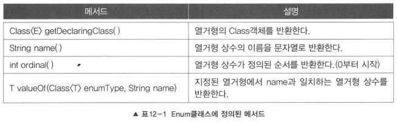

### 목차

- [Enum, 열거형이란?](#Enum,열거형이란?)
	- [열거 타입의 장점](#-)
- [열거형의 정의와 사용](#열거형의-정의와-사용)
		- [열거 타입 선언](#-)
		- [열거 타입 변수](#-)
- [모든 열거형의 조상 - java.lang.Enum](#모든-열거형의-조상-javalangenum)
		- [Enum클래스에 정의된 메소드](#enum-)
		- [name()](#name)
		- [ordinal()](#ordinal)
		- [compareTo()](#compareto)
		- [values()](#values)
		- [valueOf()](#valueof)
- [열거형에 맴버 추가하기](#열거형에-맴버-추가하기)
	- [열거형에 추상 메소드 추가하기](#-)
	- [열거 상수를 다른 값과 연결하기](#-)
	- [클래스의 static final 이용해 열거 타입 선언하기](#-static-final-)
- [열거형의 이해](#열거형의-이해)

---

# Enum, 열거형이란?

일반적으로 상수를 정의할 때, `public static final String` 으로 상수를 정의한다.
하지만 이렇게 상수를 정의하면서 다양한 문제들이 발생하게 되었고, Java 1.5버전부터는 서로 연관된 상수들의 집합을 의미하는 열겨형 클래스 Enum을 도입하게 되었다.

자바의 열거형은 열거형이 갖는 값과 타입까지 관리하기때문에  보다 논리적인 오류를 줄일 수 있다.

상수값이 바뀌면, 해당 상수를 참조하는 모든 소스를 다시 컴파일해야되지만, 열거형 상수를 사용하면 기존의 소스를 다시 컴파일 하지 않아도 된다.

예시)

Card 클래스

```java
class Card {
    static final int CLOVER = : 0;
    static final int HEART = 1;
    static final int DIAMOND = 2;
    static final int SPADE = 3;

    static final int TWO = 0;
    static final int THREE = 1；
    static final int FOUR = 2;

    final int kind;
    final int num;
}

```

enum을 활용

```java
class Card {
    enum Kind    { CLOVER, HEART, DIAMOND, SPADE }  // 열거형 Kind를정의
    enum Value   { TWO, THREE, FOUR }               // 열거형 Value를정의


    final Kind kind; // 타입이 int가 아닌 Kind임에 유의하자.
    final Value value;
}
```

자바의 열거형은 타입에 안전한 열거형(typesafe enum)' 이라서 실제 값이 같아도 타입이 다르면 컴파일 에러가 발생한다.

이처럼 값 뿐만 아니라 타입까지 체크하기 때문에 안전하다고 하는 것이다

예시)

```java
if (Card.CLOVER == Card.TWO)           // true지만 false이어야 의미상 맞음.
if (Card.Kind.CLOVER == Card.Value.TWO) // false. 값은 같지만 타입이 다름
```

## 열거 타입의 장점

1. 문자열과 비교해 IDE의 지원을 받을 수 있다. (자동완성, 오타 검증, 텍스트 리팩토링)
2. 허용 가능한 값들을 제한
3. 리팩토링 시 변경 범위가 최소화 된다. (내용 추가가 필요해도 Enum 코드 외에 수정할 필요가 없다.

---

# 열거형의 정의와 사용

열거 타입 선언을 위해서는 먼저 열거 타입의 이름을 정하고 열거 타입 이름으로 소스 파일(.java)를 생성해야 한다.  

관례상 첫 문자를 대문자로 하고 나머지는 소문자로 구성한다. 두 단어 이상으로 구성됬다면 단어의 첫 문자를 대문자로 한다.

### 열거 타입 선언

열거형을 정의하는 방법은 괄호{  }안에 상수의 이름을 나열하기만 하면된다.

```java
enum 열거형이름 {
	상수명1,
	상수명2,
	...
}
```

열거 상수는 열거 타입의 값으로 사용되는데, 관례적으로 모두 대문자로 작성한다.
여러 단어일 경우는LOGIN_SUCCESS,LOGIN_FAILED와 같이_로 연결하는 것이 관례이다.

**예시)**

동서남북 4방향을 상수로 정의하는 열거형 Direction은 다음과 같다.

```java
enum Direction {
	EAST,
	SOUTH,
	WEST,
	NORTH
}
```

### 열거 타입 변수

열거형에 정의된 상수를 사용하는 방법은 '열거형이름.상수명'이다.

(클래스의 static변수를 참조하는 것과 동일하다.)

```java
열거타입 변수;
열거타입 변수 = 열거타입.열거상수;
```

**예시)**

```java
class Unit {
    int x, y; // 유닛의 위치
    Direction dir; // 열거형을 인스턴스 변수로 선언

    void init () {
        dir = Direction.EAST; // 유닛의 방향을 EAST로 초기화
    }
}
```

열거 타입의 변수는 다음과 같이 null을 저장할 수 있는데, 열거 타입도 참조 타입이기 때문이다

```java
Direction dir = null;
```

**열거 상수는 객체일까?**

열거 상수는 열거 객체로 생성된다. 열거 타입 Direction의 경우 EAST ~ NORTH까지 4개의 Direction객체로 생성된다. 그리고 메소드 영역에 생성된 열거 상수가 해당 Direction 객체를 참조하게 된다.

```java
Direction dir = Direction.EAST;

dir == Direction.EAST// true
```

열거 타입 변수 dir은 스택 영역에 생성된다.
dir에 저장되는 값은 Direction.EAST 열거 상수가 참조하는 객체의 번지이다.
따라서 열거상수 Direction.EAST와 dir 변수는 서로 같은 Direction 객체를 참조하게 된다.

그렇기 때문에 dir 변수와 Directoin.EAST 상수의 '==' 연산 결과는 true가 된다.

열거형 상수간의 비교에는 '==' 를 사용할 수 있다.
equals()가 아닌 '=='로 비교가 가능하다는 것은 그만큼 빠른 성능을 제공한다는 얘기다.

그러나 비교연산자 ( >, <)는 사용할 수 없고 compareTo()는 사용가능하다.

```java
if(dir == Direction.EAST) {
    x++;
} else if (dir > Direction.WEST) { // 에러 . 열거형 상수에 비교연산자 사용불가
    ...
} else if (dir.compareTo (Direction.WEST) > 0) { // compareTo ()는 가능
    ...
}
```

**참고)**

compareTo()는 두 비교대상이 같으면 0, 왼쪽이 크면 양수, 오른쪽이 크면 음수를 반환한다.

---

## 모든 열거형의 조상 - java.lang.Enum


### Enum클래스에 정의된 메소드



### name()

> 열거 객체의 문자열 리턴

```java
Direction dir = Direction.EAST;
String dirName = dir.name(); // EAST
```

### ordinal()

> 열거 객체가 몇 번째인지를 리턴

열거형 상수가 정의된 순서(0부터 시작)를 정수로 반환한다.

```java
public enum Direction {
	EAST,  //0
	SOUTH, //1
	WEST,  //2
	NORTH  //3
}

Direction dir = Direction.WEST;
int ordinal = dir.ordinal();  // 2
```

### compareTo()

> 매개값으로 주어진 열거 객체를 기준으로 전 후 몇 번째 위치하는지 비교

```java
Direction dir1 = Direction.EAST;
Direction dir2 = Direction.NORTH;

int result1 = dir1.compareTo(dir2); // -3
int result2 = dir2.compareTo(dir1); // 3
```

### values()

> 열거형의 모든 상수(열거 객체)를 배열에 담아 반환한다.

```java
Direction[] dirs = Direction.values();

for(Direction dir : dirs ) {
    System.out.println(dir );
}
```

### valueOf()

> 매개값으로 주어지는 문자열과 동일한 문자열을 가지는 열거 객체(상수)를 반환한다.

외부로부터 문자열을 받아 열거 객체로 변환할 때 유용하다.

```java
Direction dir = Direction.valueOf("EAST");
```

---

# 열거형에 맴버 추가하기

Enum클래스에 정의된 ordinal()이 열거형 상수가 정의된 순서를 반환하지만, 이 값을 열거형 상수의 값으로 사용하지 않는 것이 좋다. 이 값은 내부적인 용도로만 사용되기 위한 것이기 때문이다.

열거형 상수의 값이 불연속적인 경우에는, 이때는 다음과 같이 열거형 상수의 이름 옆에 원하는 값을 괄호()와 함께 적어주면된다.

```java
enum Direction {
    EAST(l),
    SOUTH(5),
    WEST(-l),
    NORTH(10)
}
```

지정된 값을 저장할 수 있는 인스턴스 변수와 생성자를 새로 추가해 주어야 한다.

**주의)**

주의할 점은, 먼저 열거형 상수를 모두 정의한 다음에 다른 맴버들을 추가해야한다는 것이다.

그리고 열거형 상수의 마지막에 ; (세미콜론)도 잊지 말아야한다.

**예시)**

```java
enum Direction {
    EAST(l),
    SOUTH(5),
    WEST(-l),
    NORTH(10); //끝에 를추가해야한다.

    private final int value; // 정수를 저장할 필드 (인스턴스 변수) 를 추가

    Direction (int value) { this .value = value; } // 생성자를 추가

    public int getValue() { return value; }
}
```

열거형의 생성자는 제어자가 묵시적으로 private이기 때문에, 열거형의 객체를 생성할 수 없다.

```java
enum Direction {
    ...
    Direction(int value) { // private Direction(int value) 와 동일
    ...
}
```

```java
Direction d = new Direction(1); // 에러. 열거형의 생성자는 외부에서 호출불가
```

필요하다면,  하나의 열거형 상수에 여러 값을 지정할 수도 있다.
다만 그에 맞게 인스턴스 변수와 생성자 등을 새로 추가해 주어야한다.

```java
enum Direction {
    EAST(1, ">"), SOUTH(2, "V"), WEST(3, "<"), NORTH(4, "A");

    private final int value;
    private final String symbol;

    Direction (int value. String symbol) { // 접근 제어자 private이 생략됨

    this.value = value;
    this•symbol = symbol;
}

public int getValue() { return value; }

public String getSymbol() { return symbol; }
```

## 열거형에 추상 메소드 추가하기

열거형에 추상메소드를 선언할 일은 그리 많지 않다. 하지만 알아보자

열거형 Transportation은 운송 수단의 종류 별로 상수를 정의하고 있으며, 각 운송 수단에는 기본요금(BASIC_FARE)이 책정되어있다.

예시)

```java
enum Transportation {
	BUS(100),
	TRAIN(150),
	SHIP(100),
	AIRPLANE(300);

	private final int BASIC FARE;

	private Transportation(int basicFare) {
			BASIC_FARE = basicFare;
	}

	int fare () { // 운송 요금을 반환
			return BASIC_FARE;
	}
}
```

거리에 따라 요금을 계산하는 방식이 각 운송 수단마다 다를 수 있다.

이때, 열거형에 추상 메소드 'fare(int distance)'를 선언하여, 각 열거형 상수가 이 추상 메소드를 반드시 구현하게 하도록 할 수 있다.

예시)

```java
enum Transportation {
	BUS(100) {
		int fare (int distance) {
			return distance*BASIC_FARE;
		}
	},

	TRAIN(150) {
		int fare (int distance) {
			return distance*BASIC_FARE;
		}
	},

	SHIP(100) {
		int fare (int distance) {
			return distance*BASIC_FARE;
		}
	},

	AIRPLANE(300) {
		int fare (int distance) {
			return distance*BASIC_FARE;
		}
	};

	abstract int fare(int distance); // 거리에 따른 요금을 계산하는 추상 메서드

	protected final int BASIC_FARE; // protected로 해야 각 상수에서 접근가능

	Transportation(int basicFare) {
		BASIC_FARE = basicFare;
	}

	public int getBasicFare () { return BASIC_FARE; }
}
```

---

## 열거 상수를 다른 값과 연결하기

열거 상수 각각이 열거 객체이므로 열거 객체에 생성자를 사용해서 다음과 같이 열거 상수에 다른 값을 할당할 수 있다.

```java
public enum Type {
	// 상수("연결할 문자")
	WALKING("워킹화"),
	RUNNING("러닝화"),
	TRACKING("트래킹화"),
	HIKING("등산화");

    final private String name;

    private Type(Stirng name) { // enum에서 생성자 같은 역할
	    this.name = name;
    }

    public String getName() { // 문자를 받아오는 함수
	    return name;
    }
}

public class Shoes {
    public static void main(String[] args) {
        for(Type type : Type.values()){
            System.out.println(type.getName());
        }
    }
}
```

결과

```
워킹화
러닝화
트래킹화
등산화
```

---

## 클래스의 static final 이용해 열거 타입 선언하기

```java
class Type {
    static final String WALKING = "워킹화";
    static final String RUNNING = "러닝화";
    static final String TRACKING = "트래킹화";
    static final String HIKING = "등산화";
}

public class Shoes {
    public static void main(String[] args) {
        String w = Type.WALKING;
        System.out.println(w);
    }
}
```

결과

```
워킹화
```

---

# 열거형의 이해

만일 열거형 Direction이 다음과 같이 정의 되어 있을 때

```java
enum Direction { EAST, SOUTH, WEST, NORTH }
```

열거형의 상수 하나하나가 Direction객체이다. 위 문장을 클래스로 정의한다면 다음과 같다.

```java
class Direction {
	static final Direction EAST = new Direction("EAST");
	static final Direction SOUTH = new Direction("SOUTH");
	static final Direction WEST = new Direction ("WEST") ;
	static final Direction NORTH = new Direction("NORTH");

	private String name;

	private Direction(String name) {
		this.name = name;
	}
}
```

Direction클래스의 static상수 EAST, SOUTH, WEST, NORTH의 값은 객체의 주소이고, 이 값은 바뀌지 않는 값이므로 ‘==’로 비교가 가능한 것이다

---

참고 및 출처:

[https://itmining.tistory.com/149](https://itmining.tistory.com/149)

[https://woowabros.github.io/tools/2017/07/10/java-enum-uses.html](https://woowabros.github.io/tools/2017/07/10/java-enum-uses.html)

[https://mangkyu.tistory.com/73?category=872426](https://mangkyu.tistory.com/73?category=872426)

자바의 정석 - 남궁 성
