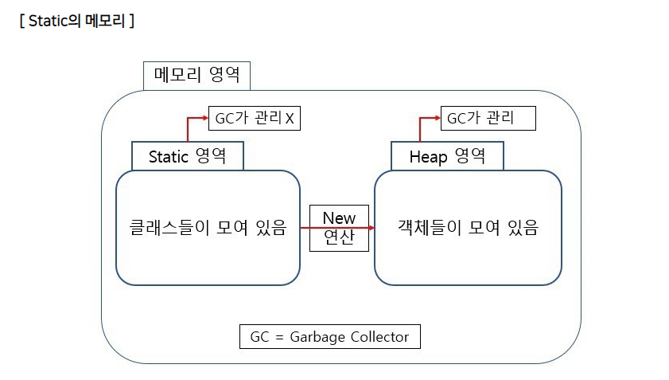

## Static Keyword (정적 키워드)

> Java 에서 Static 키워드를 사용한다는것은, 메모리에 한번 할당되어 프로그램이 종료될 때 해제되는 것을 의미한다.

<br/>

## 정적(Static) 이란?

정적(static)은 `클래스의`, `공통적인`, `고정된`이란 의미를 가지고 있다.

<br/>

static 키워드를 사용하여 `static 변수`와 `static 메소드`를 만들 수 있는데,

다른말로 `정적 필드`와 `정적 메소드`라고 하고 이 둘을 `정적 맴버`라고 한다. (클래스 맴버라고도 한다)

<br/>

정적 필드와 정적 메소드는 객체 (인스턴스)에 소속된 맴버가 아니라 클래스에 고정된 맴버이다.

인스턴스변수는 하나의 클래스로부터 생성되었더라도 각기 다른 값을 유지하지만, 클래스변수(static 맴버변수)는 인스턴스(객체)에 관계없이 같은 값을 가진다.
그 이유는 하나의 변수를 모든 인스턴스(객체)가 공유하기 때문이다.

<br/>

그렇기에 클래스 로더(Class Loader)가 클래스를 로딩해서 메소드 메모리 영역에 적재할때 클래스별로 관리된다. 따라서 클래스 로딩이 끝나는 즉시 바로 사용할 수 있다.

```java
static이 사용될 수 있는 곳 - 맴버변수, 메소드, 초기화 블럭
```

- static이 붙은 맴버변수와 메소드, 그리고 초기화블록은 인스턴스가 아닌 클래스에 관계된 것이기 때문에 인스턴스를 생성하지 않고도 사용할 수 있다.

<br/>

##### 위의 내용을 정확하게 이해하기 위해서는 메모리 영역에 대한 이해가 필요하다.
---

## Static의 메모리




일반적으로 우리가 만든 `클래스(Class)`는 `Static 영역`에 생성되고, new 연산을 통해 생성한 `객체`는 `Heap영역`에 생성된다.
객체 생성시 할당된 `Heap영역`의 메모리는 GC(Garbage Collector)를 통해 수시로 관리를 받는다.

Static 키워드를 통해 `Static 영역`에 할당된 메모리는 모든 객체가 공유하는 메모리라는 장점을 지닌다.
하지만 Garbage Collector의 관리 영역 밖에 존재하므로 Static을 자주 사용하면 프로그램의 종료시까지 메모리가 할당된 채로 존재하므로, 자주 사용하게 되면 시스템의 퍼포먼스에 `악영향`을 주게 된다.

---

## Static 맴버 선언

```java
static String name = "sulivan"; // static 변수

public static void static_method() { // static 메소드
    ...
}
```

필드(변수)나 메소드 생성시 인스턴스로 생성할것인지, 정적으로 생성할것인지에 대한 판단 기준은
`공용`으로 사용하느냐 아니냐로 내리면 된다.

정적으로 생성하려면 필드와 메소드 선언시 `static 키워드`를 추가적으로 붙이면 되고, 그냥 선언한다면 자동으로 인스턴스로 생성된다.

---

## Static 변수 (정적 변수)

> 메모리에 고정적으로 할당되어, 프로그램이 종료될때 해제되는 변수

Java에서 Static 변수는 메모리에 한번 할당되어 프로그램이 종료될 때 해제되는 변수이다.

메모리에 한번 할당되므로 여러 객체가 해당 메모리를 공유하게 된다.

```java
public class Person {
    private String name = "sulivan";

    public void print_name(){
         System.out.println(this.name);
    }
}
```

하지만 위와 같은 클래스를 통해 100명의 Person 객체를 생성하면, "sulivan"이라는 같은 값을 갖는 메모리가 100개나 중복해서 생성되게 된다.

이러한 경우에 static을 사용하여 여러 객체가 하나의 메모리를 참조하도록 하면 메모리 효율이 더욱 높아질 것이다.

또한 "sulivan"라는 이름은 결코 변하지 않는 값이므로 final 키워드를 붙여주며, 일반적으로 Static은 상수의 값을 갖는 경우가 많으므로 public으로 선언을 하여 사용한다.

이러한 이유로, 일반적으로 static 변수는 public 및 final과 함께 사용되어 `public static final`로 활용 된다.

```java
public class Person {
    public static final String name = "sulivan";

    public void print_name(){
        System.out.println(this.name);
    }
}
```

### Static 변수 특징

1. Static 변수는 `클래스 변수`이다.
2. 객체를 생성하지 않고도 Static 자원에 접근이 가능하다.

Static 변수와 Static 메소드는 `Static 메모리 영역`에 존재하므로 객체가 생성되기 이전에 이미 할당되어 있다.

그렇기 때문에 `객체의 생성없이` 바로 접근(사용)할 수 있다.

```java
public class MyCalculator {
    public static final String appName = "MyCalculator";

    //static 메소드
    public static int static_add(int x, int y) {
      return x + y;
    }
    //일반 메소드
    public int instance_min(int x, int y) {
      return x - y;
    }
}

MyCalculator.static_add(1, 2);   //o  static 메소드 이므로 객체 생성 없이 사용 가능
MyCalculator.instance_min(1, 2); //x  static 메소드가 아니므로 객체 생성후에 사용가능

MyCalculator cal = new MyCalculator();
cal.static_add(1, 2);   //o 가능은 하지만 권장하지 않는 방법
cal.instance_min(1, 2); //o
```

---

## Static Method(정적 메소드)

Static Method는 `객체의 생성 없이` 호출이 가능하며, `객체`에서는 호출이 불가능하다.

일반적으로는 유틸리티 관련 함수들은 여러 번 사용되므로 static 메소드로 구현을 하는 것이 적합하다.

 static 메소드를 사용하는 대표적인 Util Class로는 `java.uitl.Math`가 있다.


**예시)**
```java
class Name{
    static void static_method(){ // 클래스 메소드(정적 메소드)
        System.out.println("내이름은 sublivan");
    }

    void instance_method(){ // 인스턴스 메소드
        System.out.println("내 이름은 설리반");
    }
}

public class StaticTest {
    private static final String name1 = "sulivan"; // static 변수
    private String name2 = "sulivan";              // 인스턴스 변수  

    public static void printMax(int x, int y) {
        System.out.println(Math.max(x, y)); // Math.max() 정적메소드 호출
    }

    public static void printName(){
        System.out.println(name1 ); // 가능한 호출
        System.out.println(name2);  // 불가능한 호출
    }

    public static void main(String[] args)
    {
        Name.static_method(); //인스턴스 생성하지 않아도 호출 가능

        Name myname = new Name(); //인스턴스 생성
        myname.instance_method(); // 인스턴스를 생성해야만 호출가능
    }
}
```

두 수의 최대값을 구하는 경우에는 `Math클래스`를 사용하는데, static 메소드로 선언된 max 함수를 초기화 없이 사용한다.

static 메소드에서는 static이 선언되지 않은 변수에 접근이 불가능한데, 메모리 할당과 연관지어 생각해보면 당연하다.
StaticTest.printName() 을 사용하려고 하는데, `name2`은 new 연산을 통해 `객체가 생성`된 후에 메모리가 할당된다. 하지만 `static 메소드`는 `객체의 생성 없이` 접근하는 함수이므로, 할당되지 않은 메모리 영역에 접근을 하므로 문제가 발생하게 된다.

그러므로 `static 메소드`에서 접근하기 위한 변수는 `name1` 처럼 반드시 `static 변수`로 선언되어야 한다.

---

### 정리)

<table>
  <tr>
    <td>제어자</td>
    <td>대상</td>
    <td>의미</td>
  </tr>
  <tr>
    <td rowspan ="2">static</td>
    <td>맴버 변수</td>
    <td>모든 인스턴스에 공통적으로 사용되는 클래스변수가 된다. <br/> 클래스변수는 인스턴스를 생성하지 않고도 사용 가능하다. <br/> 클래스가 메모리에 로드될 때 생성된다. </td>
  </tr>
  <tr>
    <td>메소드</td>
    <td>인스턴스를 생성하지 않고도 호출이 가능한 static 메소드가 된다. <br/> static메소드 내에서는 인스턴스맴버들을 직접 사용할 수 없다.</td>
  </tr>
</table>

- 정적 맴버(정적변수, 정적메소드)는 클래스가 메모리에 올라갈 때 정적 맴버가 자동적으로 생성된다.
그렇기에 정적 맴버는 인스턴스를 생성하지 않아도 호출을 할 수 있다.

- 정적 메소드는 유틸리티 함수를 만드는데 유용하게 사용된다.
    ex) Math의 min(), max()

- 인스턴스 맴버를 사용하지 않는 메소드는 static을 붙여서 static 메소드로 선언 하는 것을 고려해보자. 가능하다면 `static 메소드`로 하는 것이 `인스턴스`를 생성하지 않고도 호출이 가능해서 더 `편리하고 속도도 더 빠르다`.


---

**참고)**
- java의 정석
- [static변수와 static메소드](mangkyu.tistory.com/47)
