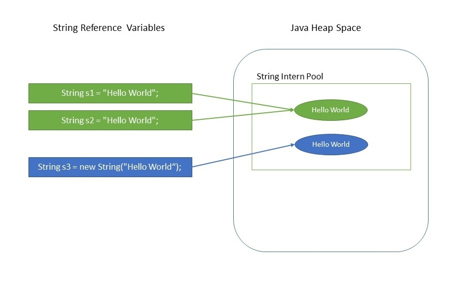

String 클래스와 관련하여
==========

| 이름 | 동기화 지원 | mutable |
| --- | :---:| ---: |
|`String` | X |  immutable |
|`StringBuilder` | X |mutable |
|`StringBuffer` | O |mutable |

## String

- String 클래스는 불변 객체로 생성된다.

- **자바에서 Heap 영역을 절약하기 위해 String Intern Pool 이란 영역이 따로 존재한다.
따라서 new 연산자를 쓰지 않는 이상, 한 번 생성된 리터럴 문자열은 같은 리터럴 생성 시 인스턴스가 새로 생성되지 않고 참조만 할 뿐이다.**



```
String s1 = "Hello World!";
String s2 = "Heelo World!";
System.out.println(s1 == s2); // true
```

- JDK 1.5 이상부터 문자열 연산시 컴파일러가 StringBuilder가 생성하여 연산한다


## StringBuilder

StringBuilder 와 StringBuffer는 내부적으로 동적 배열을 가지고 있다.

쓰레드가 안전한지 관련없을 때 사용한다.

## StringBuffer

동기화를 지원하여 안전하다.
하지만 동기화(sychronized) 지원하였기 때문에 lock을 걸고 푸는 오버헤드가 발생하여
StringBuilder 보다 느리다.

*그럼 언제 사용할까?*
**멀티쓰레드 환경에서 안전성이 필요할 때 사용한다.
static 선언된 문자열을 변경할 때, singleton으로 선언된 클래스의 문자열을 변경할 때 사용한다.**
