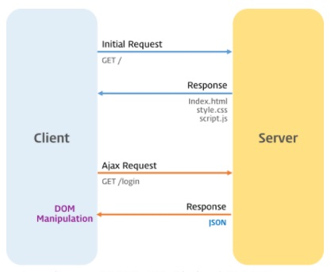

# 비동기식 처리 모델과 Ajax

### 1. Ajax (Asynchronous JavaScript and XML)

브라우저에서 웹페이지를 요청하거나 링크를 클릭하면 화면 갱신이 발생한다.

이것은 브라우저와 서버와의 통신에 의한 것이다. 


서버는 요청받은 페이지(HTML)를 반환하는데, 이때 HTML에서 로드하는 CSS나 JavaScript 파일들도 같이 반환된다.

클라이언트의 요청에 따라 서버는 정적인 파일을 반환할 수도 있고 서버 사이드 프로그램이 만들어낸 파일이나 데이터를 반환할 수도 있다.

서버로부터 웹페이지가 반환되면 클라이언트(브라우저)는 이를 렌더링하여 화면에 표시한다.


Ajax (Asynchronous JavaScript and XML)는 자바스크립트를 이용해서 <strong>비동기적(Asynchronous)</strong>으로 서버와 브라우저가 데이터를 교환할 수 있는 통신 방식을 의미한다.

서버로부터 웹페이지가 반환되면 화면 전체를 갱신해야하는데 페이지 일부만을 갱신하고도 동일한 효과를 볼 수 있도록 하는 것이 Ajax이다.

페이지 전체를 로드하여 렌더링할 필요가 없고 갱신이 필요한 일부만 로드하여 갱신하면되므로 빠른 퍼포먼스와 부드러운 화면 표시 효과를 기대할 수 있다.



<br>

----------

### 2. JSON (JavaScript Object Notation)

클라이언트와 서버 간에는 데이터 교환이 필요하다.

JSON(JavaScript Object Notation)은 클라이언트와 서버 간 데이터 교환을 위한 규칙 즉 데이터 포맷을 말한다.

JSON은 일반 텍스트 포맷보다 효과적인 데이터 구조화가 가능하며 XML 포맷보다 가볍고 사용하기 간편하며 가독성이 좋다.

자바스크립트의 객체 리터럴과 매우 흡사하다.

하지만 <strong>JSON은 순수한 텍스트로 구성된 규칙이 있는 데이터 구조이다.</strong>

```JSON
{
  "name": "Lee",
  "gender": "male",
  "age": 20,
  "alive": true
}
```

<strong>키는 반드시 큰따옴표로 둘러싸야 한다. (작은따옴표 사용불가) </strong>

<br>

#### 2.1 JSON.stringify

JSON.stringify 메소드는 객체 JSON 형식의 문자열로 반환한다.
> JSON.stringify(value[, replacer[, space]])
>
> > value
> >
> > JSON 문자열로 반환할 값
>
> > replacer(option) 
> >
> > 문자열화 동작 방식을 변경하는 함수, 혹은 JSON 문자열에 포함될 값 객체의 속성들을 선택하기 위한 화이트리트스로 쓰이는 String과 Number 객체들의 배열.
> > 
> > 이 값이 null이거나 제공되지 않으면, 객체의 모든 속성들이 JSON 문자열 결과에 포함된다.
> 
> > space(option)
> >
> > 가독성을 목적으로 JSON 문자열 출력에 공백을 삽입하는데 사용되는 String 또는 Number 객체.
> >
> > 이것이 Number 라면, 공백으로 사용되는 스페이스(space)의 수를 나타낸다.
> >
> > 스페이스가 10보다 크면 10으로 제한되고, 1보다 작은 값은 스페이스가 사용되지 않는 것을 나타낸다.
> >
> > 이것이 String 이라면, 그 문자열이 공백으로 사용된다. (문자열의 길이가 10보다 길다면 첫번째 10개의 문자가 사용)
> >
> > 이 매개변수가 제공되지 않는다면(null 이면), 공백이 사용되지 않는다. 

``` JavaScript
const who = {
    name : 'Jinmin',
    gender : 'male',
    age : '26'
};

// 객체 -> JSON 형식의 문자열
const strObject = JSON.stringify(who);
console.log(typeof strObject, strObject);
// string {"name":"Lee","gender":"male","age":20}

// 객체 -> JSON 형식의 문자열 + space
const strPrettyObject = JSON.stringify(who, null, 2);
console.log(typeof strPrettyObject, strPrettyObject);
/*
string {
  "name": "Lee",
  "gender": "male",
  "age": 20
}
*/

// replacer
// 값의 타입이 Number이면 필터링되어 반환되지 않는다.
function filter (key, value){
    if(typeof value == 'number'){
        return undefined;
    } else {
        return value;
    }
}

// 객체 => JSON 형식의 문자열 + replacer + space
const strFilteredObject = JSON.stringify(who, filter, 2);
console.log(typeof strFilteredObject, strFilteredObject);
/*
string {
  "name": "Lee",
  "gender": "male"
}
*/


const arr = [1, 5, 'false'];

// 배열 객체 -> 문자열
const strArray = JSON.stringify(arr);
console.log(typeof strArray, strArray); 
// string [1,5,"false"]

// replacer
// 모든 값을 대문자로 변환된 문자열을 반환한다.
function replaceToUpper(key, value){
    return value.toString().toUpperCase();
}

// 배열 객체 -> 문자열 + replacer
const strFilteredArray = JSON.stringify(arr, replaceToUpper);
console.log(typeof strFilteredArray, strFilteredArray);
// string "1,5,FALSE"

```

<br>

#### 2.2 JSON.parse

JSON.parse 메소드는 JSON 데이터를 가진 문자열을 객체로 반환한다.

> 서버로부터 브라우저로 전송된 JSON 데이터는 문자열이다.
>
> 이 문자열을 객체로서 사용하려면 객체화해야 하는데 이를 역직렬화(Deserializing)이라 한다.
>
> 역직렬화를 위해서 내장 객체 JSON의 static 메소드인 JSON.parse를 사용한다.

``` JavaScript
const who = {
    name : 'Jinmin',
    gender : 'male',
    age : 26
};

// 객체 -> JSON 형식의 문자열
const strObject = JSON.stringify(who);
console.log(typeof strObject, strObject);
// string {"name":"Jinmin","gender":"male","age":26}

const arr = [1, 5, 'false'];

// 배열 객체 -> 문자열
const strArray = JSON.stringify(arr);
console.log(typeof strArray, strArray); 
// string [1,5,"false"]

// JSON 형식의 문자열 -> 객체
const obj = JSON.parse(strObject);
console.log(typeof obj, obj); 
// object { name: 'Jinmin', gender: 'male', age: 26 }

// 문자열 => 배열 객체
const objArray = JSON.parse(strArray);
console.log(typeof objArray, objArray); 
// object [ 1, 5, 'false' ]
```

배열이 JSON 형식의 문자열로 변환되어 있는 경우 JSON.parse()는 문자열을 배열 객체로 변환한다.

배열의 요소가 객체인 경우 배열의 요소까지 객체로 반환한다.

``` JavaScript
const todos = [
    { id : 1, content : 'HTML', completed : true },
    { id : 2, content : 'CSS', completed : true },
    { id : 3, content : 'JavaScript', completed : false }
];

// 배열 -> JSON 형식의 문자열
const str = JSON.stringify(todos);
console.log(typeof str, str);
// string [{"id":1,"content":"HTML","completed":true},{"id":2,"content":"CSS","completed":true},{"id":3,"content":"JavaScript","completed":false}]

// JSON 형식의 문자열 -> 배열
const parsed = JSON.parse(str);
console.log(typeof parsed, parsed);
// object [
  { id: 1, content: 'HTML', completed: true },
  { id: 2, content: 'CSS', completed: true },
  { id: 3, content: 'JavaScript', completed: false }
]
```

<br>

----------

### 3. XMLHttpRequest

브라우저는 <strong>XMLHttpRequest 객체</strong>를 이용하여 Ajax 요청을 생성하고 전송한다.

서버가 브라우저의 요청에 대해 응답을 반환하면 같은 XMLHttpRequest 객체가 그 결과를 처리한다.

<br>

#### 3.1 Ajax requset

Ajax 요청 처리의 예
``` JavaScript
// XMLHttpRequset 객체의 생성
const xhr = new XMLHttpRequset();

// 비동기 방식으로 Requset를 오픈한다.
xhr.open('GET', '/users');

// Request를 전송한다.
xhr.send();
```

<br>

##### 3.1.1 XMLHttpRequset.open
XMLHttpRequest 객체의 인스턴스를 생성하고 XMLHttpRequest.open 메소드를 사용하여 서버로의 요청을 준비한다.

XMLHttpRequest.open의 사용법은

> XMLHttpRequest.open(method, url[, async])

| 매개변수 | 설명 | 
| --- | :--- |
|`method` | HTTP method ("GET", "POST", "PUT", "DELETE" 등) |
|`url` | 요청을 보낼 URL |
|`async` | 비동기 조작 여부, 옵션으로 default는 true이며 비동기 방식으로 동작한다. |

<br>

##### 3.1.2 XMLHttpRequest.send
XMLHttpRequest.send 메소드로 준비된 요청을 서버에 전달한다.

기본적으로 서버로 전송하는 데이터는 GET, POST 메소드에 따라 그 전송방식에 차이가 있다.

- GET 메소드의 경우, URL의 일부분인 쿼리문자열(query string)로 데이터를 서버로 전송한다.

- POST 메소드의 경우, 데이터(페이로드)를 <strong>request body</strong>에 담아 전송한다.


XMLHttpRequest.send 메소드에는 request body에 담아 전송할 인수를 전달할 수 있다.

``` JavaScript
xhr.send(null);
// xhr.send('string');
// xhr.send(new Blob()); // 파일 업로드와 같이 바이너리 컨텐트를 보내는 방법
// xhr.send({ form: 'data' });
// xhr.send(document);
```

만약 <strong>요청 메소드가 GET인 경우, send 메소드의 인수는 무시되고 request body는 null로 설정된다.</strong>

<br>

##### 3.1.3 XMLHttpRequest.setRequestHeader

XMLHttpRequest.setRequestHeader 메소드는 HTTP Request Header의 값을 설정한다.

setRequestHeader 메소드는 반드시 XMLHttpRequest.open 메소드 호출 이후에 호출한다.

자주 사용하는 Request Header인 Content-type, Accept에 대해 살펴보자.

<strong>Content-type</strong>

Content-type은 request body에 담아 전송할 데이터의 MIME-type의 정보를 표현한다.

| 타입 | 서브타입 | 
| --- | :--- |
|`text 타입` | text/plain, text/html, text/css, text/javascript |
|`Application 타입` | application/json, application/x-www-form-urlencode |
|`File을 업로드하기 위한 타입` | multipart/formed-data |

다음은 request body에 담아 서버로 전송할 데이터의 MIME-type을 지정하는 예이다.
``` JavaScript
// json으로 전송하는 경우
xhr.open('POST', '/users');

// 클라이언트가 서버로 전송할 데이터의 MIME=type 지정 : json
xhr.setRequestHeader('Context-type', 'application/json');

const data = { id: 3, title: 'JavaScript', author: 'Yang', price: 100000 };
xhr.send(JSON.stringify(data));
```

``` JavaScript
// x-www-form-urlencoded으로 전송하는 경우
xhr.open('POST', '/users');

// 클라이언트가 서버로 전송할 데이터의 MIME-type 지정: x-www-form-urlencoded
// application/x-www-form-urlencoded는 key=value&key=value...의 형태로 전송
xhr.setRequestHeader('Content-Type', 'application/x-www-form-urlencoded');

const data = { title: 'JavaScript', author: 'Yang', price: 100000 };

xhr.send(Object.keys(data).map(key => `${key}=${data[key]}`).join('&'));
// escaping untrusted data (신뢰할 수 없는 data)
// xhr.send(Object.keys(data).map(key => `${key}=${encodeURIComponent(data[key])}`).join('&'));
```

<strong>Accept</strong>

Http 클라이언트가 서버에 요청할 때 서버가 센드백할 데이터의 MIME-type을 Accept로 지정할 수 있다.

다음은 서버가 센드백할 데이터의 MIME-type을 지정하는 예이다.

``` JavaScript
// 서버가 센드백할 데이터의 MIME-type 지정 : json
xhr.setRequestHeader('Accept', 'application/json');
```
만약 Accept 헤더를 설정하지 않으면, send 메소드가 호출될 때 Accept 헤더가 */*으로 전송된다.

<br>

#### 3.2 Ajax response

다음은 Ajax 응답 처리의 예이다.
``` JavaScript
// XMLHttpRequest 객체의 생성
const xhr = new XMLHttpRequest();

// XMLHttpRequest.readyState 프로퍼티가 변경(이벤트 발생)될 때마다 onreadystatechange 이벤트 핸들러가 호출된다.
xhr.onreadystatechange = function (event) {
    // readyStates는 XMLHttpRequest의 상태(state)를 반환
    // readyState: 4 => DONE(서버 응답 완료)
    if(xhr.readyState !== XMLHttpRequest.DONE){
        return;
    }
    
    // status는 response 상태 코드를 반환 : 200 => 정상 응답
    if(xhr.status === 200){
        console.log(xhr.responseText);
    } else {
        console.log('Error!');
    }
}; 
```

위 코드를 자세히 살펴보면,

XMLHttpRequest.send 메소드를 통해 서버에 Request를 전송하면 서버는 Response를 반환한다.

하지만 언제 Response가 클라이언트에 도달할 지는 알 수 없다.

XMLHttpRequest.onreadystatechange는 Response가 클라이언트에 도달하여 발생된 이벤트를 감지하고 콜백 함수를 실행하여 준다.

이때 이벤트는 Request에 어떠한 변화가 발생한 경우 즉, XMLHttpRequest.readyState 프로퍼티가 변경된 경우 발생한다.

``` JavaScript
// XMLHttpRequest 객체의 생성
var xhr = new XMLHttpRequest();
// 비동기 방식으로 Request를 오픈한다.
xhr.open('GET', 'data/test.json');
// Request를 전송한다.
xhr.send();

// XMLHttpRequest.readyState 프로퍼티가 변경(이벤트 발생)될 때 마다 콜백함수(이벤트 핸들러)를 호출한다.
xhr.onreadystatechange = function (event) {
    // 이 함수는 Response가 클라이언트에 도달하면 호출된다.
};
```

XMLHttpRequest 객체는 Response가 클라이언트에 도달했는지를 추적할 수 있는 프로퍼티를 제공한다.

이 프로퍼티가 바로 XMLHttpRequest.readyState이다.

만일 XMLHttpRequest.readyState의 값이 4인 경우, 정상적으로 Response가 돌아온 경우이다.

readXMLHttpRequest.readyState의 값은 다음과 같다.

| Value | State | Description |
| :---: | :--- | :--- |
| 0 | `UNSENT` | XMLHttpRequest.open() 메소드 호출 이전 |
| 1 | `OPENED` | XMLHttpRequest.open() 메소드 호출 완료 |
| 2 | `HEADERS_RECEIVED` | XMLHttpRequest.send() 메소드 호출 완료 |
| 3 | `LOADING` | 서버 응답 중(XMLHttpRequest.responseText 미완성 상태) |
| 4 | `DONE` | 서버 응답 완료 |

``` JavaScript
// XMLHttpRequest 객체의 생성
var xhr = new XMLHttpRequest();
// 비동기 방식으로 Request를 오픈한다.
xhr.open('GET', 'data/text.json');
// Request를 전송한다.
xhr.send();

// XMLHttpRequest.readyState 프로퍼티가 변경(이벤트 발생)될 때마다 콜백함수(이벤트 핸들러)를 호출한다.
xhr.onreadystatechange = function (event) {
    // 이 함수는 Response가 클라이언트에 도달하면 호출된다.

    // readyStates는 XMLHttpRequest의 상태(state)를 반환
    // readyState: 4 => DONE(서버 응답 완료)
    if(xhr.readyState !== XMLHttpRequest.DONE){
        return;
    }

    // status는 response 상태 코드를 반환 : 200 -> 정상 응답
    if(xhr.status === 200){
        console.log(xhr.responseText);
    } else {
        console.log('Error!');
    }
};
```

XMLHttpRequest의 readyState가 4인 경우, 서버 응답이 완료된 상태이므로 이후 XMLHttpRequest.status가 200(정상 응답)임을 확인하고 정상인 경우, XMLHttpRequest.responseText를 취득한다.

XMLHttpRequest.responseText에는 서버가 전송한 데이터가 담겨있다.

만약 서버 응답 완료 상태에만 반응하도록 하려면 readystatechange 이벤트 대신 load 이벤트를 사용해도 된다.

load 이벤트는 서버 응답이 완료된 경우에 발생한다.

``` JavaScript
// XMLHttpRequest 객체의 생성
var xhr = new XMLHttpRequest();
// 비동기 방식으로 Request를 오픈한다.
xhr.open('GET', 'data/text.json');
// Request를 전송한다.
xhr.send();

// load 이벤트는 서버 응답이 완료된 경우에 발생한다.
xhr.onload = function (event) {
    // status는 response 상태 코드를 반환 : 200 -> 정상 응답
    if(xhr.status === 200){
        console.log(xhr.responseText);
    } else {
        console.log('Error!');
    }
};
```

<br>

----------
### 참조

[poiemaweb](https://poiemaweb.com/js-ajax)

[MDN web docs](https://developer.mozilla.org/en-US/docs/Web/API/XMLHttpRequest/Using_XMLHttpRequest)
