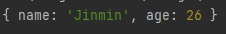
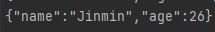

# JavaScript Parsing, Parser

### Parsing
특정 문서(HTML, XML)를 읽어 다른 프로그램이나 서브루틴이 사용할 수 있는 내부의 표현 방식으로 변환해 주는 것

컴파일러의 일부로 원시 프로그램의 명령문이나 온라인 명령문, HTML 문서 등에서 Markup Tag 등을 입력하여 받아들여 구문을 해석할 수 있는 단위로 여러 부분으로 분할해주는 역할

<sub>'printf("hello")'라는 구문이 있다면 기계어로 바꾸기 전에 printf와 (, ", hello, ", )로 단어와 기호들을 하나씩 나누는 것. 이후에 컴파일이 진행됨.</sub>

<br>

### Parser
Parsing을 하는 프로세서, 즉 parser가 Parsing을 하는 것이다.

Parser란 컴파일러의 일부로 컴파일러나 인터프리터에서 원시 프로그램을 읽어 들여 그 문장의 구조를 알아내는 Parsing(구문 분석)을 행하는 프로그램

원시 프로그램의 명령문이나 온라인 명령문, HTML 문서 등에서 Markup Tag 등을 입력으로 받아들여 구문을 해석할 수 있는 단위로 여러 부분으로 분할해주는 역할

컴파일러나 인터프리터에서 원시 프로그램을 읽어 들여 그 문장의 구조를 알아내는 Parsing(구문분석)을 행하는 프로그램

<br>


----------

### Parsing 과정
- 브라우저는 HTML을 DOM 트리로 Parsing(파싱)한다.
  - HTML 파싱에는 토큰화와 트리 구조가 포함된다.
  - HTML 토큰에는 시작 태그와 마침 태그가 포함되며, 속성 이름과 값도 포함된다.
  - Parser(파서)는 토큰화된 입력값을 문서에 파싱하며, Document 트리를 구성한다.
  - 예를 들어, XML문서에서 tag이름이 "Name"인 요소의 값이 얼마인지, 혹은 tag이름이 "Name"인 요소 중 맨마지막 것이 무엇인지 읽어내는 것이 Parsing(파싱)이다.
- HTML Parser(파서)가 이미지와 같은 비블로킹 자료(non-blocking resources)를 발견할 경우, 브라우저는 해당 자료를 요청하고 계속 Parsing(파싱)을 진행한다.
  - Parsing은 CSS파일이 발견될 때 까지 계속될 수 있으나, `<script>`태그는 렌더링을 차단하고, HTML 파싱을 중단시킨다.
- 브라우저가 CSS 스타일을 발견할 경우, 텍스트를 CSS 스타일링 레이아웃과 페인팅에 사용하는 데이터 구조인 Object Model(또는 CSSOM)로 파싱한다.
- 이후 브라우저는 스크린에 컨텐츠를 표시하기 위해 해당 구조로부터 렌더 트리를 생성한다.
- 자바스크립트 파싱은 메소드가 호출되는 과정인 컴파일 타임(compile time)이나 Parser(파서)가 호출될 때 진행된다.

----------
### JavaScript JSON

JSON의 일반적인 용도는 웹 서버와 data를 주고 받는 것이다.

JSON은 네트워크 데이터 전송방식의 표준 Format으로 사용되고 있다.

JSON은 String 문자열 이므로 실제 JavaScript에서 사용하기 위해서는 파싱하여 객체로 사용할 수 있다.

JSON 객체에는 parse와 stringify가 내장되어 있어서 `String -> Object` `Object -> String`으로 변환할 수 있다.

<br>

#### JSON 객체의 parse (String -> Object 변환)
웹 서버에서 data를 수신 할 때 data는 항상 문자열입니다.
JSON Format 방식을 가지고 있는 String 데이터를 parse를 통해 Object로 변환하는 것이다.
```JavaScript
let jsonString = JSON.parse('{"name" : "Jinmin", "age" : 26}');
```
;

<br>

#### JSON 객체의 stringify (Object -> String 변환)
 - 웹 서버에 data를 보낼 때 data는 문자열이어야합니다.
 - Object를 JSON Format 방식을 가진 상태로 타입을 String으로 변환하는 것이다.
```JavaScript
let object = {name: "Jinmin", age: 26};
let objectToJson = JSON.stringify(object);
```
;

----------
#### 참조

[na27](https://na27.tistory.com/230)

[w3schools_parse](https://www.w3schools.com/js/js_json_parse.asp)

[w3schools_stringify](https://www.w3schools.com/js/js_json_stringify.asp)
