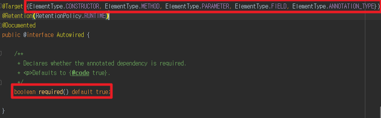

@Autowired
=======================

- 의존성을 주입받기 위한 어노테이션
- <code>@Autowired</code> 가 선언된 코드들은 스프링 컨테이너에게 등록된 <code>Bean</code> 객체들을 자동으로 받아 사용할 수 있다

```java
@Component
public class Jinmin{
  @Autowird
  private YoungGon carryMachine; // 스프링 컨테이너가 해당 Bean 생성 시 등록된 Bean, YoungGon 객체를 자동으로 주입한다
}
```



<code>@Autowired</code> 를 뜯어보면

**required** 를 선택할 수 있다

- <code>required</code> 는 주입받는 객체가 반드시 <code>Bean</code>으로 등록되어야 하는지 선택사항이다
- default 는 true

그럼 언제 false를 쓸까?

현직 개발자한테 물어보니

> 아직까지 경험해보지 못했지만

> 다른 라이브브러리등을 사용하는데, 꼭 필요하지 않는 경우, 없으면 없는데 null로 구동후
>
> if 처리로 해당 로직을 스킵하는 경우가 있을수도 있겠네요.

라고 답변해주셨다.

*행여 이 글을 읽는 분들도 <code>@Autowird(required = false)</code> 사용한 경험이 있다면 공유 부탁드립니다*


<code>@Autowired</code> 의 타겟은 총 5가지

생성자, 메소드, 파라미터, 필드, 어노테이션에 사용할 수 있다

그 중에서 대표적인 사용법인 필드, 생성자, 메소드(Setter)에 대해 알아보면

## 1. 필드

```java
@Component
public class Jinmin{
  @Autowird
  private YoungGon carryMachine;
}
```

Spring <code>Container</code> 가 해당 <code>Bean</code> 생성 시 자동으로 주입해준다

## 2. 메소드

```java
@Component
public class Jinmin{
  private YoungGon carryMachine;

  @Autowired
  public void setCarryMachine(YoungGon youngGon){
    carryMachine = YoungGon;
  }
}
```

Spring <code>Container</code> 가 해당 <code>Bean</code> 생성 시 해당 메소드에 자동으로 주입시켜 필드를 초기화한다

필드의 의존성 주입과는 다르게 이후 해당 메소드를 호출하여 필드를 초기화할 수 있다

즉, 필드 의존성 주입같은 경우 Spring <code>Container</code> 이외에 주입할 수 있는 방법이 없다

## 3. 생성자

```java
@Component
public class Jinmin{
  private YoungGon carryMachine;

  @Autowired
  public Jinmin(YoungGon youngGon){
    carryMachine = youngGon;
  }
}
```

Spring <code>Container</code> 가 해당 <code>Bean</code> 생성 시 생성자 파라미터의 Bean을 주입시킨다

생성자 주입같은 경우 <code>@Autowired</code> 를 생략 가능하다

--------

Spring <code>4.3</code> 부터 <code>@Autowired</code> 를 생성자 방법으로 사용할 것을 권장한다

그 이유는

1. 필드에 <code>final</code> 를 선언할 수 있다
2. 생성자 파라미터가 많아지게 되면 리팩토링이 필요한다는 것을 인식할 수 있다
3. 순환 참조를 방지할 수 있다
    - 순환 참조
    ```java
    @Component
    public class MinSub{
      @Autowird
      private Hyeyeon gf;

      public void date(){
        gf.date();
      }
    }

    @Component
    public class Hyeyeon{
      @Autowired
      private Minsub bf;

      public void date(){
        bf.date();
      }
    }
    ```

    위 코드를 보면 알 수 있듯이 서로를 필드로 주입받고 있고 <code>date()</code> 메소드 호출 시 무한히 서로를 불러서 결국 <code>StackOverFlowError</code> 를  발생시킨다.

    하지만 생성자의 경우 컴파일 단계에서 순환 참조했을 경우 실행조차 안된다

4. 테스트 코드를 작성할 수 있다


------

- 의존성 주입 선택

예를 들어 아래와 같이 같은 인터페이스를 구현한 클래스들이 있고 해당 인터페이스를 주입받는 상황이라고 하자

```java
@Component
public class YoungGon{
  @Autowird
  private TeamITDA team;

  public void study(){
    team.study();
  }
}

@Component
public class Jinmin implements TeamITDA{
  @Override
  public void study(){
    //js study...
  }
}

@Component
public class Minsub implements TeamITDA{
  @Override
  public void study(){
    //java study...
  }
}

@Component
public interface TeamITDA{
  void study();
}
```

위 코드를 실행하게 되면 <code>NoUniqueBeanDefinitionException</code> 을 뱉는다

<code>TeamITDA</code> 를 구현한 <code>Bean</code> 이 중복되기 때문에

어떠한 <code>Bean</code> 을 주입시킬 시 명시 해주어야한다


### 1. @Primary

최우선으로 선택될 <code>Bean</code> 을 명시할 때 사용한다

```java
@Component
@Primary
public class Minsub implements TeamITDA{
  //생략
}
```

### 2. @Qualifier

해당 <code>Bean</code> 의 값을 참조할 때 사용한다

보통 <code>Bean</code> 들이 생성될 때 <code>Bean</code> 의 default 값은 소문자이다

또한 각 컴포넌트

예를 들면 <code>@Component, @Controller, @Service, etc...</code> 들은 옵션으로

<code>value</code> 값 설정해줄 수 있다

이 <code>value</code> 값을 설정하고 @Qualifier 로 불러올수 있다


```java
@Component
public class YoungGon{
  @Autowird
  @Qualifier("jinmin")
  private TeamITDA team;

  //
}
```

위 코드의 경우 <code>Jinmin</code> 객체가 자동으로 주입된다

```java
@Component
public class YoungGon{
  @Autowird
  @Qualifier("mini")
  private TeamITDA team;

  //
}

@Component("mini")
public class Jinmin implements TeamITDA{
  @Override
  public void study(){
    //js study...
  }
}
```

위 코드 또한 <code>Jinmin</code> 객체가 자동으로 주입된다


> 원문 <br>
> [스프링 - 생성자 주입을 사용해야 하는 이유, 필드인젝션이 좋지 않은 이유](https://yaboong.github.io/spring/2019/08/29/why-field-injection-is-bad/) <br>
> [@Autowired의 사용](https://tbang.tistory.com/87)
