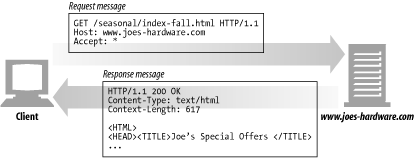
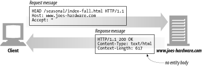
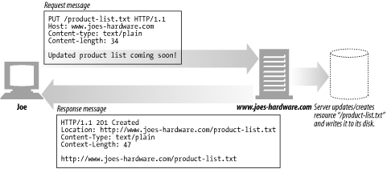
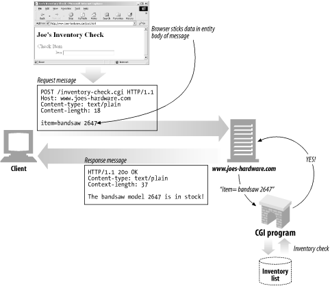
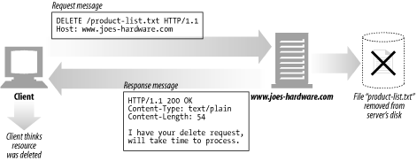
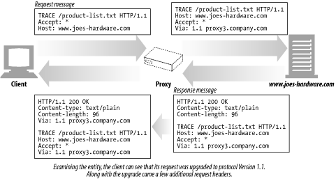
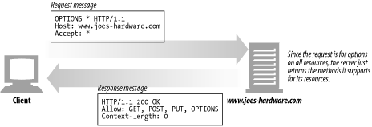
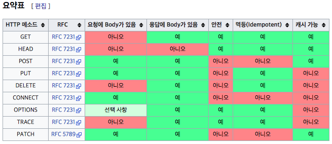

# HTTP 요청 메소드

##### 클라이언트가 웹 서버에게 사용자 요청의 목적/종류를 알리는 수단이다.

HTTP는 요청 메소드를 정의하여, 주어진 리소스에 수행하길 원하는 행동을 나타낸다.

그래서 간혹 "HTTP동사" 라고 부르기도 한다.

각각의 메소드는 서로 다른 의미를 구현하지만, 일부 기능은 메소드 집합간에 서로 공유하기도 한다.

이틀테면 응답 메소드는 [안전(safe](https://developer.mozilla.org/en-US/docs/Glossary/safe))하거나, [캐시 가능](https://developer.mozilla.org/en-US/docs/Glossary/cacheable)(cachealbe)하거나, [멱등성](https://developer.mozilla.org/ko/docs/Glossary/Idempotent)을 가질 수 있다.

# 요청 종류

- GET, HEAD, PUT, POST, PATCH, DELETE, TRACE, OPTION, CONNECT

## GET

> 요청받은 URI의 정보를 검색하여 응답한다.

- GET을 사용하는 요청은 오직 데이터를 받기만한다. (서버 Resource를 읽음)
- URI 형식으로 웹 서버 측 리소스를 요청, 파라미터를 넘겨서 해당하는 본문 형식을 받는다.

```jsx
GET [request-uri]?query_string HTTP/1.1
Host:[Hostname] 혹은 [IP]
```



위 그림처럼 URI형식으로 서버에 요청해 데이터를 받는다.

그러므로 본인이 서버에 파라미터를 날릴 때 url에 요청한 파라미터가 찍힌다.

이 것이 보기 싫다면 POST로 요청해야한다.

## HEAD

> GET과 동일하지만, 서버에서 Body를 Return 하지 않는다. (응답 본문을 포함하지 않음),
메세지 헤더(문서 정보)만 응답.

- Resource(데이터)를 받지 않고 오직 찾기만 원할때
- Object가 존재할 경우 응답의 상태 코드를 확인할때
- 서버의 응답 헤더를 봄으로써 Resource가 수정 되었는지 확인

```jsx
HEAD [request-uri] HTTP/1.1
Host:[Hostname] 혹은 [IP]
```

GET과 유사한 방식이지만, 실제 문서를 요청하는 것이 아니라, 문서 정보를 요청하는 것이다.

이에 따라 HTTP 응답 메세지에 본문(Body)없이 HTTP 헤더 정보만을 보낸다.




## PUT

> 요청된 자원을 수정(UPDATE)한다.
내용 갱신 위주(파일 전송 가능), 서버에 문서를 쓸때 사용 (GET과 반대)

- PUT 메소드는 서버가 **Client 요청의 Body를 확인**한다.
요청된 URI에 정의된 새로운 Resource를 생성하기 위함이다.
- 요청된 URI이 존재할 경우 대체하여 사용한다.
- 내용 갱신을 위주로 하기때문에 Location : URI를 보내지 않아도 된다.

```jsx
PUT [requeset-uri] HTTP /1.1
Host: [Hostname] 혹은 [IP]
Content-Length:[Length in Bytes]
Content-Type:[Contnet Type]
[데이터]
```

POST처럼 정보를 서버로 제출하는 것이나 보통 갱신 위주다.



## POST

> 요청된 자원을 생성(CREATE) 한다.
내용 전송(파일 전송 가능)
Server에 Input Data를 보내기 위함 (HTML form에 많이 사용)

- 클라이언트에서 서버로 전달하고자하는 정보를 서버로 보낸다.
- 특정 리소스에 엔티티를 제출할 때 쓰인다.
- 새로 작성된 Resource(데이터)인 경우 HTTP헤더 항목 Location : URI주소를 포함하여 응답한다.

```
POST [request-uri] HTTP/1.1
Host:[Hostname] 혹은 [IP]
Content-Length:[Length in Bytes]
Content-Type:[Content Type]
[데이터]
```



## PATCH

> PUT과 유사하게 요청된 자원을 수정(UPATE) 할 때 사용한다.

- PATCH는 해당자원의 일부를 교체하는 의미로 사용

```
PATCH [request-uri] HTTP/1.1
Host:[Hostname] 혹은 [IP]
Content-Lenght:[Length in Bytes]
Content-Type:[Content Type]
[데이터]
```

## DELETE

> 요청된 자원을 삭제할 것을 요청한다. (안전성 문제로 대부분의 서버에서 비활성)

- **요청 Resource(웹 리소스(데이터))를 삭제**하도록 요청한다
그러나!! HTTP 규격에는 Client의 요청에도 서버가 무효화 시킬수 있도록 정의되어 있다
- DELETE Method는 항상 보장되지 않는다.
실제로 삭제되지 않았지만, 클라이언트는 파일이 삭제 되었다고 생각할 수 있다.

```
DELETE [request-uri] HTTP/1.1
Host:[Hostname] 혹은 [IP]
```



## TRACE

> 요청 리소스가 수신되는 경로를 보여줌
원격지 서버에 루프백 메시지를 호출하기 위해 테스트용으로 사용

- Client로 부터 Request Packet이 "방화벽, Proxy Server, Gateway" 등을 거치면서 packet의 변조가 일어날 수 있는데, 이 때 Server에 도달 했을 때의 최종 Packet의 Request Packet을 볼 수 있다.

즉, **Original Data와 서버에 도달했을 때의 비교본 Data를 서버의 응답 Body를 통해 확인 할 수 있다.**
요청의 최종 수신자는 반드시 **송신자에게 200(OK) 응답의 내용(Body)로 수신한 메세지를 반송**해야 한다.**최초 Client의 요청에는 Body가 포함될수 없다.**

```
TRACE [request-uri] HTTP/ 1.1
Host: [Hostname] 혹은 [IP]
```



## OPTIONS

> 웹서버에서 지원되는 메소드의 종류를 확인할 경우 사용한다

- 목적 Resource의 통신을 설정하는데 쓰인다.
- 웹 서버측 제공 메소드에 대한 질의, Target Server의 지원 가능한 method
(GET, POST … 를 알아보기 위함)
이 경우 응답 메세지에 HTTP 헤더 항목 중 'Allow: GET, POST, HEAD'처럼 보내게 된다.

```
OPTIONS [request-uri] HTTP/ 1.1
Host: [Hostname] 혹은 [IP]
```



## CONNECT

> 동적 터널 모드를 교환, 프록시 기능을 요청시 사용(프록시 서버와 같은 중간 서버 경유)

- 이 메소드는 요청한 리소스에 대해 양방향 연결을 시작하는 메소드다.
CONNECT 메소드는 SSL(HTTPS)를 사용하는 웹 사이트 접속하는데 사용할 수 있다.
- 클라이언트는 원하는 목적지와 TCP연결을 HTTP 프록시 서버에 요청한다.
그러면 서버는 클라이언트 대신하여 연결의 생성을 진행한다.
한번 서버에 의해 연결이 수립되면, 프록시 서버는 클라이언트에 오고가는 TCP 스트림을 계속해서 프록시한다.

```
CONNECT [request-uri] HTTP/1.1
Host:[Hostname] 혹은 [IP]
```

<br/>

---

## HTTP 멱등성



멱등(idempotent)의 의미는 같은 작업을 계속 반복해도 같은 결과가 나오는 경우를 의미한다.

동일한 자원에 대한 GET요청이라면 클라이언트에 반환되는 모든 응답은 동일해야 한다.
특정 자원에 대한 DELETE의 경우도 자원은 더이상 이용 할 수 없어야 하며, DELETE요청을 다시 호출한 경우도 자원은 여전히 사용할 수 없는 상태여야 한다


<br/>

---

# 생각해볼 내용!

## HTTP GET 과 POST의 차이

둘다 HTTP 프로토콜을 이용해 서버에 무언가 요청할 때 사용하는 방식이다.

- GET 요청은 모든 필요한 데이터를 URI에 포함하여 요청한다. 그렇기 때문에 주소창에 전달값이 노출된다.
URI 길이의 제한이 있기 때문에 전송 데이터양이 한정되어 있고, 형식에 맞지 않으면 인코딩 해서 전달해야한다.

반면에 POST 요청은 클라이언트에서 서버로 전송할 때  HTTP BODY에 데이터를 포함해서 전달한다.
웹 브라우저 사용자 눈에는 직접적으로 파라미터가 노출되지 않기 때문에 URI  길이와 전송되는 데이터 양의 제한이 없다.

- GET 메소드를 사용하면 모든 form data는 URI로 인코딩되어 action URI에 query string parameters로 전달된다.
POST 메소드를 사용하면 form data는 HTTP request의 message body에 나타날 것이다.

- GET은 보통 가져올 때, POST는 수행하는 역할에 활용한다.
GET은 SELECT 성향이 있어서 서버에서 어떤 데이터를 가져와서 보여주는 용도로 활용하고,
POST는 서버의 값이나 상태를 바꾸기 위해 활용한다.

<br/>

---

## HTTP POST와 PUT의 차이

- PUT은 UPDATE개념, POST는 INSERT개념으로 생각하면 이해하기 쉽다.

- 동일한 자원을 여러번 POST하면 서버자원에는 변화가 생기지만, 여러번 PUT 하는 경우는 변화가 생기지 않는다.

즉, POST는 멱등하지 않고 PUT은 멱등하다.

<br/>

PUT의 경우 클라이언트가 명확하게 리소스 위치를 지정한다. (/dogs/3)

따라서, 아무리 많이 수행되더라고 리소스 위치가 지정되어 자원이 생성되지 않으며, 동일한 리소스(/dogs/3)를 수정하기 때문에 여러번 요청하더라도 멱등하다.

```
PUT /dogs/3 HTTP/1.1
{"name":"blue","age":5}
```

<br/>

POST의 경우 클라이언트가 리소스 위치를 지정하지 않는 경우 사용된다. (/dogs)

따라서, 아래와 같은 요청이 여러번 수행되는 경우 매번 새로운 dog가 생성되어 dogs/3, dog/4 등 매번 새로운 자원이 생성되기 때문에 멱등하지 않다.

```
POST/dogs HTTP/1.1
{"name":"blue","age":5}
HTTP/1.1 201 Created
```

<br/>

---

## HTTP PUT과 PATCH의 차이

**PUT이 해당 자원의 전체를 교체(갱신)** 하는 의미를 지니는 대신,

**PATCH는 해당 자원의 일부를 변경한다는 의미**를 지니기 때문에 최근 update 이벤트에서 PUT보다 더 의미적으로 적합하다고 평가받고 있다.

또한 "PUT의 경우는 멱등"하지만, "PATCH의 경우는 멱등"하지 않다.

PUT은 전체 자원을 업데이트 하기 때문에 동일 자원에 대해서 동일하게 PUT을 처리하는 경우 멱등하게 처리된다.

반면 PATCH로 처리되는 경우 자원의 일부가 변경되기 때문에 멱등성을 보장할 수 없다.

<br/>

---

#### 참고)

※ **멱등 (idempotent)**


: 연산을 여러 번 적용하더라도 결과가 달라지지 않는 성질을 의미한다 (사전적)

  같은 작업을 계속 반복해도 같은 결과가 나오는 경우를 의미한다.

동일한 자원에 대한 GET요청이라면 클라이언트에 반환되는 모든 응답은 동일해야 한다.

특정 자원에 대한 DELETE의 경우도 자원은 더이상 이용할 수 없어야 하며, DELETE요청을 다시 호출한 경우도 자원은 여전히 사용할 수 없는 상태여야 한다.

<br/>

※ **Resource(자원)**


: HTTP 요청 대상을 "리소스"라고 부르는데, 그에 대한 본질을 이 이상으로 정의할 수 없다
그것은 문서, 사진 또는 다른 어떤 것이든 될 수 있다.
각 리소스는 리소스 식별을 위해 HTTP 전체에서 사용되는 URI(Uniform Resource Identifier)에 의해 식별된다.

<br/>

리소스 식별에 대해 더 알고 싶다면

- [웹 리소스 식별](https://developer.mozilla.org/ko/docs/Web/HTTP/Basics_of_HTTP/Identifying_resources_on_the_Web)

<br/>

---

<br/>

##### 참고 및 출처)

[https://medium.com/@lyhlg0201/http-method-d561b77df7](https://medium.com/@lyhlg0201/http-method-d561b77df7)
[https://zorba91.tistory.com/136](https://zorba91.tistory.com/136)
[https://javaplant.tistory.com/18](https://javaplant.tistory.com/18)
