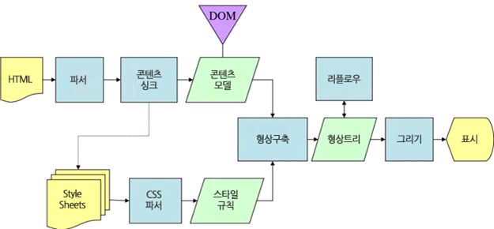

# 브라우저 동작 원리

## 브라우저의 주요 기능

##### 사용자가 참조 하고자 하는 웹페이지를 서버에 `요청(Request)`하고 `응답(Response)`을 받아 브라우저에 표시하는 것이다.

 

요청한 자원은 보통 HTML 문서이지만 PDF나 이미지(image) 또는 다른 형태일 수 도 있다.

자원의 주소는 URI(Uniform Resource Identifier)에 의해 정해진다.

 

브라우저는 HTML과 CSS 명세에 따라 HTML파일을 해석해서 표시하는데, 이 명세는 웹 표준화 기구인 W3C(World Wide Web Consortium)에서 정한다.

>과거에는 브라우저들이 일부만 이 명서에 따라 구현하고 독자적인 방법으로 확장함으로써 웹 제작자가 심각한 호환성 문제를 겪었지만, 최근에는 대부분의 브라우저가 표준 명세를 따른다.

 

브라우저의 사용자 인터페이스는 보통 비슷한 요소들이 존재한다.

>시간이 지나면서, 사용자에게 필요한 서비스의 장점을 모방하면서 갖춰지게 되었다.

 

#### 다음과 같은 요소들이 일반적이다.

- URI를 입력할 수 있는 주소 표시줄
- 이전 버튼과 다음 버튼
- 북마크 (즐겨찾기)
- 새로 고침버튼, 현재 문서의 로드를 중단할 수 있는 정지버튼
- 홈 버튼

 

브라우저의 사용자 인터페이스는 표준 명세가 없음에도 불구하고, 수 년간 서로의 장점을 모방하면서 현재에 이르게 되었다.

HTML5 명세는 주소표시줄, 상태표시줄, 도구 모음과 같은 일반적인 요소를 제외하고 브라우저의 필수 UI를 정의하지 않았다.

물론 파이어폭스의 다운로드 관리자와 같이 브라우저에 특화된 기능도 있다.

 

##### 참고)

[URL과 URI에 대해](https://blog.lael.be/post/61)

---

## **브라우저의 기본 구조**

 

브라우저의 주요 구성 요소

 

#### 사용자 인터페이스

- 주소표시줄, 이전/다음버튼, 북마크메뉴등
요청한 페이지를 보여주는 창을 제외한 나머지 모든 부분이다.

#### 브라우저 엔진

- 사용자 인터페이스와 렌더링 사이의 동작을 제어

#### 렌더링 엔진

- 요청한 콘텐츠를 표시
예를 들어 HTML을 요청하면, HTML과 CSS를 파상하여 화면에 표시

#### 통신

- HTTP 요청과 같은 네트웤 호출에 사용
이것은 플랫폼에 독립적인 인터페이스이고 각 플랫폼 하부에서 실행

#### 자바스크립트 해석기

- 자바스크립트(JavaScript) 코드를 해석하고 실행

#### UI 백엔드

- 콤보 박스와 창 같은, 기본적인 장치를 그림
플랫폼에서 명시하지 않은 일반적인 인터페이스로써, OS(운영체제) 사용자 인터페이스 체계를 사용

#### 자료저장소

- 자료를 저장하는 계층 (모든 종류의 자원을 하드디스크에 저장)
쿠키를 저장하는 것과 같이 모든 종류의 자원을 하드 디스크에 저장할 필요가 있다.
HTML5 명세에는 브라우저가 지원하는 '[웹 데이터베이스](https://www.html5rocks.com/en/features/storage)'가 정의되어있다.

---

## 렌더링

### 렌더링 엔진

역할

- 요청 받은 내용을 브라우저 화면에 표시해준다.

HTML 및 XML 문서와 이미지를 표시할 수 있다.

##### 참고)

플러그인이나 브라우저 확장 기능을 이용해 PDF와 같은 다른 유형도 표시할 수 있다.  (추가로 확장이 필요한 유형은 바로 뜨지 않고, 팝업으로 확장 여부를 묻는 것을 볼 수 있다.)

 

### 렌더링 엔진 종류

- 크롬, 사파리:
웹킷(Webkit) 엔진 사용
- 파이어폭스:
게코(Gecko) 엔진사용 (모질라에서 직접 만듬)

#### 웹킷(Webkit)

* 최초 리눅스 플랫폼에서 동작하기 위해 제작된 오픈소스 엔진
애플이 맥과 윈도우에서 사파리 브라우저를 지원하기 위해 수정을 더했다.
* 더 자세한 내용은 [webkit.org](http://webkit.org/)

 

### 렌더링 동작 과정

- 렌더링 엔진은 통신으로 부터 요청한 문서의 내용을 얻는 것으로 시작하는데 문서의 내용은 보통 8KB단위로 전송된다.

 

먼저 HTML 문서를 파싱한다

그리고 콘텐츠 트리 내부에서 태그를 모두 `DOM 노드`로 변환한다.

그 다음 외부 CSS 파일과 함께 포함된 스타일 요소를 `파싱`한다.

스타일 정보와 HTML 표시 규칙은 `렌더 트리`라고 부르는 또 다른 트리를 생성한다.
`렌더 트리`는 색상 또는 면적과 같은 시각적 속성이 있는 사각형을 포함하고 있다.

이렇게 생성된 렌더 트리는 정해진 순서대로 화면에 표시되는데, 생성 과정이 끝났을 때 `배치`가 시작되면서 노드가 화면의 정확한 위치에 표시되는것을 의미한다

다음은 `UI 백엔드`에서 렌더 트리의 각 노드를 가로지르며 형상을 만들어 내는 `그리기 과정`이다.

>일련의 과정들이 점진적으로 진행된다는 것을 아는 것이 중요하다.

`렌더링 엔진`은 가능하면 빠르게 사용자에게 내용을 표시하기 위해(즉, 좀 더 나은 사용자 경험을 위해) 모든 HTML을 파싱할 때까지 기다리지 않고 `배치`와 `그리기 과정`을 시작한다.

네트워크로부터 나머지 내용이 전송되기를 기다리는 동시에, 받은 내용의 일부를 먼저 화면에 표시한다.

>우리가 웹페이지에 접속할때 한꺼번에 뜨지 않고 점점 화면에 나오는 이유

 

### 동작 과정 예

- 웹킷 동작 과정 (크롬, 사파리)

- 게코 렌더링 엔진 동작 과정 (파이어 폭스)

 

#### "DOM"

> Document Object Model (문서 객체 모델)

웹페이지 소스를 까보면 `<html>`, `<body>`와 같은 태그들이 존재한다.

이를 javascript가 활용할 수 있는 객체로 만들면 문서 객체가 된다.

모델은 말 그대로, 모듈화로 만들었다거나 객체를 인식한다라고 해석하면 된다.

 

즉, DOM은 웹 브라우저가 HTML페이지를 인식하는 방식을 말한다. (트리구조)

 

#### "어태치먼트(attachment)"

웹킷이 렌더 트리를 생성하기 위해 DOM 노드와 시각 정보를 연결하는 과정이다.

 

##### 참고)

웹킷과 게코가 용어를 약간 다르게 사용하고 있지만 동작 과정은 기본적으로 동일하다.

 

웹킷은 "렌더 객체(render object)"로 구성되어 있는 "렌더 트리(render tree)"라는 용어를 사용한다.

게코는 시각적으로 처리되는 렌더 트리를 "형상 트리(frame tree)"라고 부르고,각 요소를 형상(frame)이라고 한다.

 

웹킷은 요소를 배치하는데 "배치(layout)" 라는 용어를 사용하지만,

게코는 "리플로(reflow)" 라고 부른다.

 

게코는 HTML과 DOM 트리 사이에 "콘텐츠 싱크(content sink)"라고 부르는 과정을 두는데,

이는 DOM 요소를 생성하는 공정으로 웹킷과 비교하여 의미있는 차이점이라고 보지는 않는다.

---

## 파싱과 DOM 트리 구축

> 파싱은 렌더링 엔진에서 매우 중요한 과정이다.

 

### 파싱(parsing)

문서 파싱은, 브라우저가 코드를 이해하고 사용할 수 잇는 구조로 변환하는 것을 의미한다.

 

문서를 가지고 `어휘 분석`과 `구문 분석` 과정을 거쳐 `파싱 트리`를 구축한다.

>즉, 어휘 분석기를 통해 언어의 구문 규칙에 따라 문서 구조를 분석한다.

 

이 과정에서 `구문 규칙`과 일치하는지 비교하고, 일치하는 노드만 `파싱 트리`에 추가시킨다.

>끝까지 규칙이 맞지 않는 부분은 문서가 유효하지 않고 구문 오류가 포함되어 있다는 것

 

컴파일 과정일뿐, 파서트리가 나왔다고 해서 끝이 아니다.

다시 `기계코드 문서`로 변환시키는 과정까지 완료되면 최종 결과물이 나오게 된다.

 

보통 이런 파서를 생성하는 것은 문법에 대한 규칙 부여 등, 복잡하고 최적화하기 힘들다.

그러므로 자동으로 생성해주는 `파서 생성기`를 많이 활용한다.

> 웹킷은 플렉스(flex), 바이슨(bison)을 이용하여 유용하게 파싱이 가능

 

우리가 head 태그를 실수로 빠뜨려도, 파서가 돌면서 오류를 수정해준다.
> head 엘리먼트 객체를 암묵적으로 만들어준다

결국, 이 **파싱 과정** 을 거치면서 서버로부터 받은 문서를 브라우저가 이해하고 쉽게 사용할 수 있는 `DOM 트리구조`로 변환시켜주는 것이다.

---

## 정리 및 요약

주소창에 url을 입력하고 Enter를 누르면, 서버에 요청이 전송된다.

해당 페이지에 존재하는 여러 자원들(text, image 등)이 보내진다.

이제 브라우저는 해당 자원이 담긴 HTML과 스타일이 담긴 CSS 를 W3C 명세에 따라 해석한다.

이 역할을 하는 것이 `렌더링 엔진`

렌더링 엔진은 우선 HTML 파싱 과정을 시작한다.
HTML 파서가 문서에 존재하는 어휘와 구문을 분석하면서 `DOM 트리`를 구축한다.

다음엔 CSS 파싱 과정을 시작한다.
CSS 파서가 모든 CSS 정보를 스타일 구조체로 생성한다.

이 2가지를 연결시켜 `렌더 트리`를 만든다.
렌더 트리를 통해 문서가 시각적 요소를 포함한 형태로 구성된 상태이다.

화면에 `배치`를 시작하고, `UI 백엔드`가 노드를 돌며 형상을 그린다.

이때 빠른 브라우저 화면 표시를 위해 `배치와 그리는 과정`은 페이지 정보를 모두 받고 한꺼번에 진행되지 않는다.

자원을 전송받으면, 기다리는 동안에 일부분 먼저 진행하고 화면에 표시한다.

---
 
 

##### 참고 및 출처)
https://d2.naver.com/helloworld/59361
https://gyoogle.dev/blog/
https://velog.io/@yhe228/%EB%B8%8C%EB%9D%BC%EC%9A%B0%EC%A0%80-%EB%8F%99%EC%9E%91-%EC%9B%90%EB%A6%AC-rok5h9zpqd
